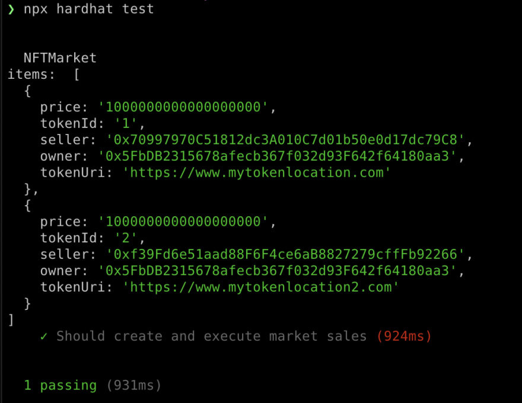
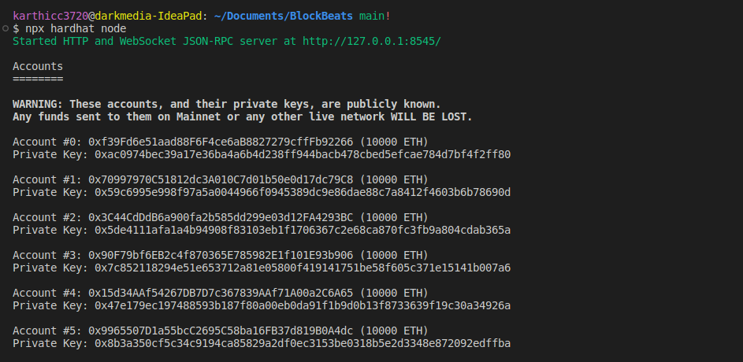
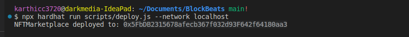
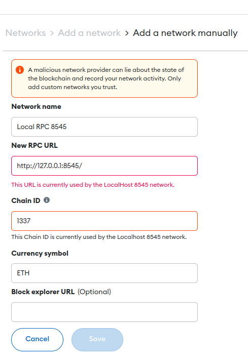
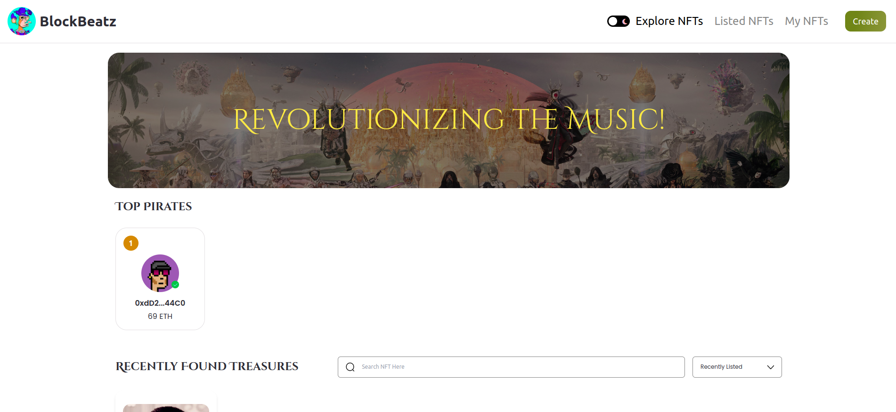
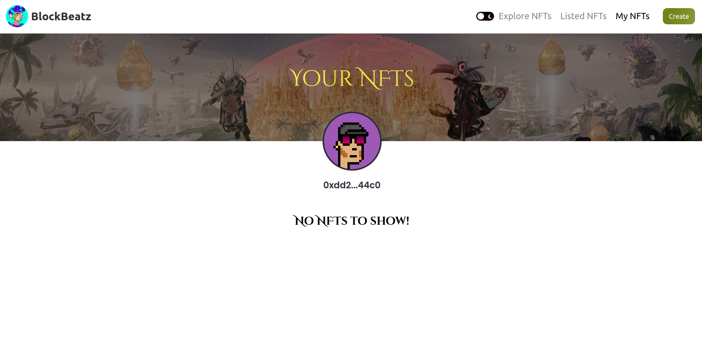

<!-- PROJECT LOGO -->
<br />
<div align="center">
    

  <h3 align="center">BlockBeatz</h3>

  <p align="center">
  A decentralized music owning platform built with Polygon. Power to the musicians.
    <br />
    <a href="#">View Website </a>
    <br />
    <a href="#">View Smart Contract</a>
  </p>
</div>

<!-- TABLE OF CONTENTS -->
<details>
  <summary>Table of Contents</summary>
  <ol>
    <li>
      <a href="#about-the-project">About The Project</a>
      <ul>
        <li><a href="#built-with">Built With</a></li>
      </ul>
    </li>
    <li>
      <a href="#getting-started">Getting Started</a>
      <ul>
        <li><a href="#prerequisites">Prerequisites</a></li>
        <li><a href="#installation">Installation</a></li>
      </ul>
    </li>
    <li><a href="#usage">Usage</a></li>
    <li><a href="#roadmap">Roadmap</a></li>
    <li><a href="#license">License</a></li>
    <li><a href="#contact">Contact</a></li>
  </ol>
</details>

<!-- ABOUT THE PROJECT -->

## About The Project

**BlockBeatz** is a proof-of-concept decentralized application built on the Hardhat local blockchain, designed to revolutionize the music industry by providing a direct-to-fan model for musicians to sell digital songs. With **BlockBeatz**, artists can offer unique and limited edition copies of their songs that are digitally signed and stored on the blockchain.

The goal of **BlockBeatz** is to create a decentralized application that enables musicians to earn a sustainable living from their music, without having to rely on traditional music industry gatekeepers. By introducing the concept of royalties, **BlockBeatz** aims to make it possible for more people to earn a living from their music.

The application is built using Next.js, which provides fast and efficient server-side rendering, and utilizes web 3 storage metadata storage on the blockchain. The smart contract is deployed on Polygon, using the Truffle suite, which simplifies the deployment process and ensures seamless integration with the blockchain.

With **BlockBeatz**, fans can support their favorite artists by purchasing unique digital assets that are authenticated on the blockchain. This not only provides a way for fans to connect with the music and each other but also ensures that artists are fairly compensated for their work.


## Built With

- Hardhat Network
- Next.js
- Truffle
- Tailwindcss
- Web3 storage

<p align="right">(<a href="#top">back to top</a>)</p>


<!-- GETTING STARTED -->

## Getting Started

To get a local copy of **BlockBeatz** up and running, please follow these steps.

## Prerequisites
<ol>
<li>Node.js version 16.14.0 or greater installed on your machine. I recommend installing Node using either nvm or fnm.</li>
<li> Metamask wallet extension installed as a browser extension </li>
</ol>

## Installation

1. Clone the repo

   ```sh
   git clone https://github.com/wroetoshaw/BlockBeats.git
   ```
2. Install Dependencies
   ```sh
   npm instal --legacy-peer-deps
   ```
    --legacy-peer-deps is a command line option that can be used with npm install or npm update to allow installation or update of packages with peer           dependencies that are not compatible with the current version of npm.

3. Initialize tailwindcss
   ```sh
   npx tailwindcss init -p (already configured)
   ```
4. Initialize Hardhat
   ```sh
   npx hardhat (already configured)
   ```
5. Test Smart Contract
   ```sh
   npx hardhat test
   ```
   If the test runs successfully, it should log out an array containing the two marketplace items.
           [](assets/npxtest.jpeg)

   
6. To spin up a local network, open your terminal and run the following command:
   ```sh
   npx hardhat node
   ```
   This should create a local network with 20 accounts.
        [](assets/node.png)

   
   Next, keep the node running and open a separate terminal window to deploy the contract.

7. In a separate window, run the following command:
   ```sh
   npx hardhat run scripts/deploy.js --network localhost
   ```
   When the deployment is complete, the CLI should print out the address of the contract that was deployed.
   
   update constants.js file
   ```sh
   export const MarketAddress = '';
   ```
<p align="right">(<a href="#top">back to top</a>)</p>

## Metamask Setup

1.  To test the application, you can import the accounts created by the node into your Metamask wallet. These accounts are pre-funded with 10000 ETH. To import one of these accounts, you need to switch your Metamask wallet network to Localhost 8545.
     [](assets/meta1.jpg)

     
2.  Next, in MetaMask click on Import Account from the accounts menu:
     [](assets/meta2.jpg)

     
3.  Copy then paste one of the Private Keys logged out by the CLI and click Import. Once the account is imported, you should see some the Eth in the account:
     [](assets/meta3.jpg)

     
4.  It is recommended to use 2 or 3 accounts when importing them into your Metamask wallet so that you can test the different functionalities available between users.

5.  If you dont have local rpc setup go to add network and add rpc link and chain id:1337
      [](assets/addmeta.png)


##  Running the app
1.  Now we can test out the app! To start the app, run the following command in your CLI:
    ```sh
    npm run dev
    ```
NODE: Keep other terminals running. 

<!-- USAGE EXAMPLES -->

## Screenshots

[](assets/ss1.png)
[](assets/ss2.png)


<!-- [](assets/ss1.png) -->
<!-- [](assets/ss2.png) -->


<p align="right">(<a href="#top">back to top</a>)</p>

<!-- ROADMAP -->

## Roadmap

- [x] Add the Home section
- [x] Add the Create section
- [x] Add the Marketplace section
- [x] Add the List Music section
- [x] Add the Top Artists section
- [ ] Artist Events

<p align="right">(<a href="#top">back to top</a>)</p>

<!-- LICENSE -->

## License

Distributed under the MIT License. See `LICENSE.md` for more information.

<p align="right">(<a href="#top">back to top</a>)</p>

## Contact


Project Link: [https://github.com/wroetoshaw/BlockBeats](https://github.com/wroetoshaw/BlockBeats)

<p align="right">(<a href="#top">back to top</a>)</p>

<!-- ACKNOWLEDGMENTS -->

## Acknowledgments

